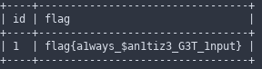

#Weak Bank (web)

###Step 1
Find the vulnerable parameter


###Step 2
Find the correct payload (using random-agent)


###Step 3
Database name dump  


###Step 4
Find name of tables   


### Step 5
Dump the flag tables    


```text
FLAG --> flag{a1ways_$an1tiz3_G3T_1nput}
```
